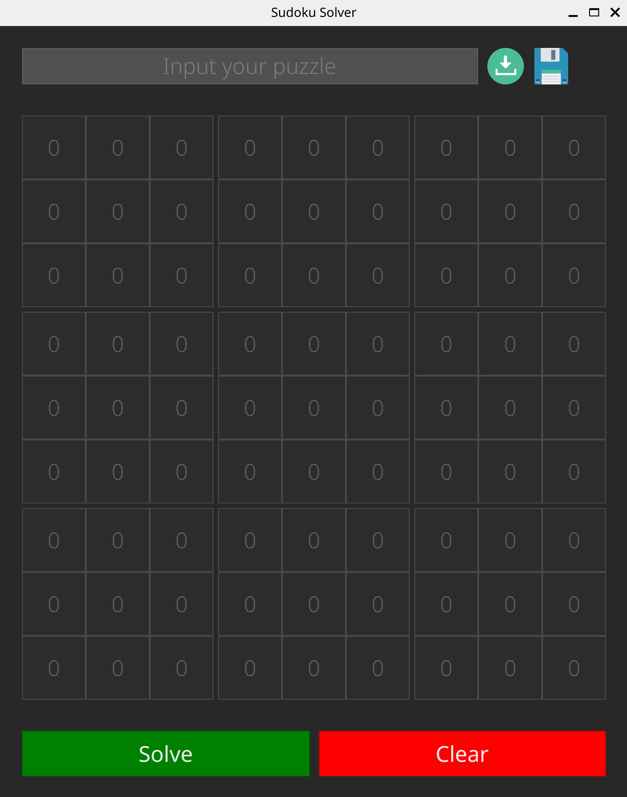

# Решатель судоку

## Как запустить SLINT версию

```bash
    cargo run --release --bin slint_main 
```



## Как запустить GTK версию

```bash
    cargo run --release --bin gtk_main 
```

:warning: **GTK версия еще не полностью реализована**
